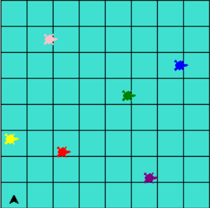
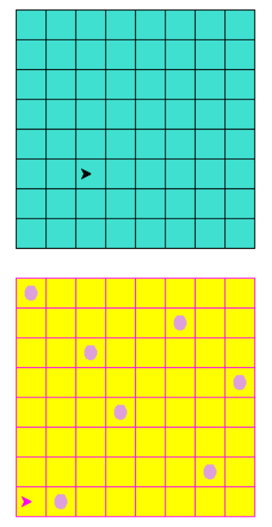
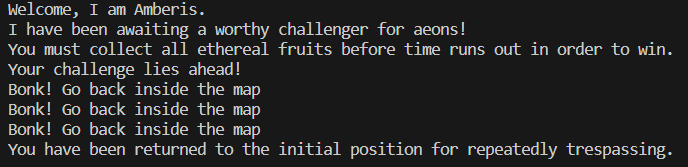

# Turtle Trails - Map Adventures and Mini-Game Quests
This project is a turtle graphics game where the player controls a turtle character on a game board. The objective of the game is to collect all the ethereal fruits before time runs out. The player can move the turtle character using keyboard controls and interact with non-playable characters (NPCs) within the game.

# Languages and Frameworks/Libraries
The project is implemented using **Python** and utilizes the **Turtle** graphics library. Turtle provides a simple and intuitive way to create graphics and animations in Python.

# Installation and Execution
1. Make sure you have Python installed on your system (version 3.x).
2. Clone the project repository from GitHub.
3. Open a terminal or command prompt and navigate to the project directory.
4. Run the following command to install the required dependencies:
```
pip install turtle
```
5. Once the installation is complete, execute the following command to start the game:
```
python turtle_trails.py
```

# Configuration
1. Upon launching the game, you will be presented with a game board displayed using the Turtle graphics.
2. The player character, represented by a turtle, can be controlled using the keyboard controls.
    * Press 'a' to turn the turtle left.
    * Press 'd' to turn the turtle right.
    * Press 'w' to move the turtle forward.
    * Press the spacebar to stop the game.
3. Interact with the non-playable characters (NPCs) on the game board by moving the player character close to them.
4. Each NPC may have different interactions and dialogues. They will provide instructions or hints to progress in the game.
5. The goal is to collect all the ethereal fruits within the given time limit. The fruits are represented by circles on the game board.
6. Move the player character over a fruit to collect it. The collected fruits will be hidden, and the fruit count will increase.
7. The game ends when all the fruits are collected or when the time limit is exceeded.

# Snapshots
* Map Setup


* Minigame Demo


* NPC Interaction


# Conclusion
This turtle graphics game provides an interactive and challenging gameplay experience. By collecting all the ethereal fruits within the given time, players can successfully complete the game. The project demonstrates the use of Python and the Turtle graphics library to create a visually engaging game. Enjoy playing and have fun!
